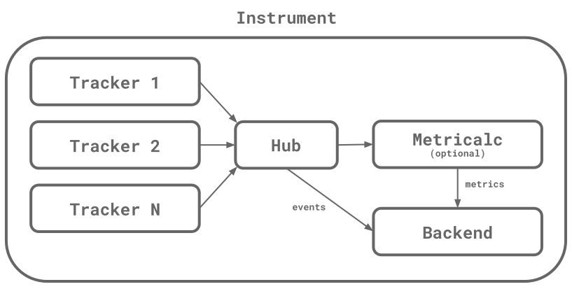

# OpenAVT-Docs
Documentation repository for the OpenAVT project.

1. [ Introduction ](#intro)
2. [ Platforms ](#platform)
3. [ Structure and Behavior ](#struct)
4. [ Data Model ](#model)
5. [ KPIs ](#kpi)

## 1. Introduction

The Open Audio-Video Telemetry is a multiplatform set of tools for performance monitoring in multimedia applications. The objectives are similar to those of the OpenTelemetry project, but specifically for sensing data from audio and video players.

## 2. Platforms

Currently, OpenAVT supports the following platforms:

- [iOS / tvOS](https://github.com/asllop/OpenAVT-iOS)
- [Android](https://github.com/asllop/OpenAVT-Android)

Visit the repositories and check out the README for specific installation and usage instructions.

## 3. Structure and Behavior

### 3.1 The Instrument

In OpenAVT the central concept is the **Instrument**. An instrument contains a chain of objects that captures, processes, and transmits data from a multimedia player. Each of these three steps is represented by:

- **Trackers**: Used to capture data from a specific player. A tracker also keeps its state (but shouldn't modify it, this is a job for the Hub).

- **Hub**: Contains the business logic. Is used to process the data captured by a tracker, update states, and transform events if necessary.

- **Metricalc**:  Used to calculate metrics. This step is optional.

- **Backend**: Used to transmit data to a data service, database, business intelligence system, storage media, or similar.

These objects represent a chain because the data goes from one step to the next in a straight line. The data captured by a tracker is sent to the hub, then it goes to the metric calculator, and finally to the backend.

One instrument can contain multiple trackers, but only one hub, one metricalc, and one backend.

### 3.2 The Data

We talked about data being captured and passed along the instrument chain, but what is the nature of this data?

In OpenAVT the main data unit is the **Event**. An event contains an **Action** and a list of **Attributes**.

The action tells us what is the event about, for example when a video starts, an event with the action `OAVTAction.Start` is sent.

The attributes offer context for the actions. For example, the attribute `OAVTAttribute.duration` informs the stream duration in milliseconds.

OpenAVT can also generate **Metrics**, using a specific step called metricalc (Metric Calculator). A metric is defined by three properties: name (`String`), value (`Float` or `Integer`), and type (`Counter` or `Gauge`). An example of a metric is `OAVTMetric.StartTime`, which informs the time elapsed between a video is requested and it starts playing.

Both events and metrics are time-series data, and thus both contain a `timestamp` property, defining the moment when it was created.

### 3.3 The Chain

The instrument chain describes the steps followed by an event from the moment it is created until the end of its life.

1. The journey of an event starts with a call to `OAVTInstrument.emit(...)`, which can be called from anywhere, but it's usually called from within a tracker. This function takes an action and a tracker and generates an event. Initially, the event only contains few attributes: the sender ID (that identifies a tracker within an instrument), and the timer attributes of previous events.
2. Once the event is created it is sent to the tracker, calling the method `OAVTTracker.initEvent(...)`. This method receives an event and returns it, in between it can be tranformed by adding/changing attributes (calling `OAVTEvent.setAttribute(...)`), or even it can stop the chain by returning null.
3. The event passed by the tracker is sent to the hub, calling `OAVTHub.processEvent(...)`. This method works like the previous, it takes an event and returns it and in between, it can be transformed, blocked, etc.
4. If a metricalc is defined, the event is passed to it by calling `OAVTMetricalc.processMetric(...)`. This method returns an array of metrics (instances of `OAVTMetric`). The array can be empty if no metrics are generated.
5. Finally, the event and the metrics are passed to the backend by calling `OAVTBackend.sendEvent(...)` and `OAVTBackend.sendMetric(...)`. These methods return nothing, and the chain ends here.

## 4. Data Model

The Data Model describes all the data an instrument could generate and the meaning of each piece of information.

### 4.1 The telemetry dilemma: Events or Metrics?

First, let's define what are Events and Metrics in the context of OpenAVT. Both are time series data, but there are some differences:

An **Event** is a heterogeneous structure of data. It contains a list of key-value pairs, where the key is always a string but the value could be of any type: integer, float, string, or boolean. Two events of the same type (or how they are called in OpenAVT, same **Action**), may contain different combinations of key-value pairs (**Attributes**, as they are called in OpenAVT).

A **Metric** on the other side is homogeneous, there is one single value per metric and it's always numeric (integer or float). Two metrics of the same type have always the same kind of data.

Choosing between events and metrics depends on many factors: the kind of calculations we want to do, the amount of data we can store, how often we are going to update our KPIs, where we are going to store our data (the chosen backend), etc.

In general, events offer more flexibility to calculate important indicators. We have almost "raw" information, so if we want to make some KPI calculations today, but our needs change over time, it's possible to update the queries on the recorded data without having to change the instrument code. The main disadvantage of events is that they consume lots of space, so our database will grow rapidly.

Metrics are small and don't get too much space on a database. Queries over metrics are also much faster to process. But the information we store is very specific and, in general, with metrics, we have to hardcode the KPIs we want to generate on the instrument side. If these needs change, we will face the problem of updating the instrument code. In OpenAVT this job is done in the **Metricalc**.

Also, some backends can work better with (or only support) one kind of data. For example, Graphite only offers support for metrics (that's actually not true, it supports events, but they are so limited that doesn't fit the needs of OpenAVT Events).

### 4.2 Events

Events indicate that something happened in the tracker lifecycle and player workflow. Each event has a type, that in OpenAVT is called Action. The following is an exhaustive list of the available actions. Not all actions are used in all contexts and some players don't support certain actions.

| Action | Description |
| ------ | ----------- |
| `TrackerInit` | A tracker has been initialized. |
| `PlayerSet` | A player instance has been passed to the tracker. |
| `PlayerReady` | The player instance is ready to start generating events. |
| `MediaRequest` | An audio/video stream has been requested, usually by the user (tapping a play button, choosing a video from a list, or similar). This action is meant to be app-driven, not fired by the player. |
| `PrepareItem` | The player is preparing an item to be loaded/played. Not all players support this action. |
| `ManifestLoad` | The manifest is being loaded. Not all players support this action. |
| `StreamLoad` | An audio/video stream is being loaded. |
| `Start` | Stream has started, the first frame shown. |
| `BufferBegin` | Player started buffering. |
| `BufferFinish` | Player ended buffering. |
| `SeekBegin` | Started seeking. |
| `SeekFinish` | Ended seeking. |
| `PauseBegin` | Stream paused. |
| `PauseFinish` | Stream resumed. |
| `ForwardBegin` | Fast forward begins. Not all players support this action. |
| `ForwardFinish` | Fast forward finish. Not all players support this action. |
| `RewindBegin` | Fast rewind begins. Not all players support this action. |
| `RewindFinish` | Fast rewind finish. Not all players support this action. |
| `QualityChangeUp` | Stream quality (resolution) increased. |
| `QualityChangeDown` | Stream quality (resolution) degraded. |
| `Stop` | Playback has been stopped. Usually called when the user closes the player or selects another content before ending the current, and so it's app-driven. |
| `End` | Stream reached the end. |
| `Next` | Next stream in a playlist is going to be loaded. Not all players support this action. |
| `Error` | An error happened. |
| `Ping` | Sent every 30 seconds. It's started after a `Start` and stopped after an `End`, `Stop`, `Next` or unrecoverable `Error`. |
| `AdBreakBegin` | An ad break (block) has started. An ad break may contain multiple ads. |
| `AdBreakFinish` | Ad break finished. |
| `AdBegin` | Ad started, the first frame shown. |
| `AdFinish` | Ad ended. |
| `AdPauseBegin` | Ad paused. |
| `AdPauseFinish` | Ad resumed. |
| `AdBufferBegin` | Ad started buffering. |
| `AdBufferFinish` | Ad ended buffering. |
| `AdSkip` | Ad skipped. |
| `AdClick` | User tapped on the ad. |
| `AdFirstQuartile` | Ad reached the first quartile. |
| `AdSecondQuartile` | Ad reached the second quartile. |
| `AdThirdQuartile` | Ad reached the third quartile. |
| `AdError` | An error happened during ad playback. |

The common workflow of events for most playbacks is as follows:

1. `TrackerInit` when the tracker is ready.
2. `PlayerSet` when the player instance is passed to the tracker.
3. `PlayerReady` when all listeners have been set and the player is ready to generate events.
4. `StreamLoad` when a stream starts loading.
5. `Start` when the stream ends loading and starts playing.
6. After it, can happen any number of the following blocks: `BufferBegin`/`BufferFinish`, `PauseBegin`/`PauseFinish`, or `SeekBegin`/`SeekFinish`. Also can happen quality changes (`QualityChangeUp`, `QualityChangeDown`).
7. Finally, an `End` or `Stop` will happen when the stream ends or is stopped by the user.

An `Error` can happen at any time during the player lifecycle. An error usually implies the end of the playback, so use to be followed by an `End`.

An ad block can happen at any time during the content playback. The workflow of ads is as follows:

1. `AdBreakBegin` when the block starts.
2. `AdBegin` when an ad starts.
3. `AdFirstQuartile `, `AdSecondQuartile `, and `AdThirdQuartile ` when the corresponding quartiles are reached.
4. `AdFinish` when the ad reaches the end.
5. After it, if there are more ads in the block, the workflow starts again on 2.
6. When all ads are played, an `AdBreakFinish` is sent.

An `AdSkip` when the user skips the ad can happen at any time.
An `AdClick` when the user taps the ad can happen at any time.
An `AdError` can happen at any time and is usually followed by `AdFinish` and also commonly by an `AdBreakFinish`.

### 4.3 Attributes

As we already said, an event is composed out of an action and a list of attributes. Here we present the list of attributes generated by OpenAVT. Again, like in events, not all attributes are always present in all trackers. Some information may not be available in certain players.

Note: Times are in milliseconds.

| Attribute | Data Type | Description |
| --------- | :-------: | ----------- |
| `trackerTarget` | String | Which player or event source is the tracker attached to. |
| `streamId` | String | UUID that identifies a specific stream playback. It's generated when `StreamLoad` happens and is different every time, even if the stream source is the same. |
| `playbackId` | String | Is similar to `streamId`, but it's generated every time there is a `StreamLoad` or a `MediaRequest` and recalculated when there is an `End`, `Stop`, or `Next`. |
| `senderId` | String | Identifier of the tracker that generated the event. It identifies a tracker within an instrument. |
| `countErrors` | Integer | Number of `Error` events sent. |
| `countStarts` | Integer | Number of `Start` events sent. |
| `accumPauseTime` | Integer | Accumulated time during pause blocks (`PauseBegin` / `PauseFinish`). |
| `accumBufferTime` | Integer | Accumulated time during buffering blocks (`BufferBegin` / `BufferFinish`). |
| `accumSeekTime` | Integer | Accumulated time during seeking blocks (`SeekBegin` / `SeekFinish`). |
| `accumPlayTime` | Integer | Accumulated time during playback, not counting ad, pause, buffering, or seeking blocks. |
| `deltaPlayTime` | Integer | Time playing since last event. |
| `inPauseBlock` | Boolean | Currently within a pause block. |
| `inSeekBlock` | Boolean | Currently within a seeking block. |
| `inBufferBlock` | Boolean | Currently within a buffering block. |
| `inPlaybackBlock` | Boolean | Currently playing. |
| `errorDescription` | String | When an `Error` happens, description of that error. Usually, the error message is taken from the error object. |
| `position` | Integer | Current playback position in milliseconds. |
| `duration` | Integer | Stream duration in milliseconds. |
| `resolutionHeight` | Integer | Stream vertical resolution. |
| `resolutionWidth` | Integer | Stream horizontal resolution. |
| `isMuted` | Boolean | Playback muted. |
| `volum` | Integer | Volume, from 0 to 100. |
| `fps` | Float | Frames per second. |
| `source` | String | Stream source, usually a URL. |
| `bitrate` | Integer | Stream bitrate in bits per second. |
| `language` | String | Stream language. |
| `subtitles` | String | Stream subtitles language. |
| `title` | String | Stream title. |
| `isAdsTracker` | Boolean | It is an ads tracker or not. |
| `countAds` | Integer | Number of ads played. |
| `inAdBreakBlock` | Boolean | Currently within an ad break block. |
| `inAdBlock` | Boolean | Currently playing an ad. |
| `adPosition` | Integer | Ad playback position in milliseconds. |
| `adDuration` | Integer | Ad duration in milliseconds. |
| `adBufferedTime` | Integr | Amount of Ad stream buffered time. |
| `adVolume` | Integer | Ad volume, from 0 to 100. |
| `adRoll` | String | Ad position within the main stream (pre, mid, or post). |
| `adDescription` | String | Ad description. |
| `adId` | String | Ad identifier. |
| `adTitle` | String | Ad title. |
| `adAdvertiserName` | String | Advertiser name. |
| `adCreativeId` | String | Creative identifier. |
| `adBitrate` | Integer | Ad bitrate in bits per second. |
| `adResolutionHeight` | Integer | Ad vertical resolution. |
| `adResolutionWidth` | Integer | Ad horizontal resolution. |
| `adSystem` | String | Ad system. |

The is also a family of attributes called time-since attributes. They indicate the time elapsed since a certain event was sent. For example, `timeSinceTrackerInit` is the time since `TrackerInit` was sent. Every event has a time-since attribute associated.

### 4.4 Metrics

Metrics represent a numerical value that varies over time. OpenAVT supports two types of metrics: Gauge and Counter.

**Counter** measures the number of occurrences. 
**Gauge** represents a value that can increase or decrease.

For OpenAVT these types are purely semantical, they have no implications in how the system behaves. But some backends support these types and it has implications in how metrics are stored, aggregated, and queried.

| Metric | Type | Description |
| ------ | :--: | ----------- |
| `StartTime` | Gauge | The time that takes to start playing since the stream is requested until the first frame is shown. |
| `NumPlays` | Counter | Number of plays. |
| `RebufferTime` | Gauge | Time of rebuffering, that is the time spent in buffering blocks that are not the initial loading. |
| `NumRebuffers` | Counter | Number of rebuffering events. |
| `PlayTime` | Gauge | Time playing. |
| `NumRequests` | Counter | Number of stream requests. |
| `NumLoads` | Counter | Number of stream loads. |
| `NumEnds` | Counter | Number of stream ends. |

## 5. KPIs

In this section, we are going to expose general terms of how to calculate the most common audio-video KPIs using the OpenAVT data model. But not the exact practice of KPI calculation, because this is something that depends on the platform where our data is recorded. A query made for InfluxDB is different from a query for New Relic.

### 5.1 Start Time

Time elapsed since the stream starts loading until it starts playing.

Is the `timeSinceStreamLoad` (or `timeSinceMediaRequest`) value of the `Start` event. This one is probably the most used KPI in audio & video telemetry.

### 5.2 Number of Playbacks

The number of playbacks started during a certain period.

The simple count of `Start` events.

### 5.3 Concurrent Playbacks

The number of concurrent playbacks at a certain moment.

The count of `Ping` events. To be accurate the time range selected must be of 30 seconds because is the ping period. We could improve the granularity by sending pings more often, at the cost of increasing the traffic and database size.

### 5.4 Aborted Before Video Start

The proportion (or number) of streams that started loading but never started playing.

Is the difference between the number of `StreamLoad` and the number of `Start` events.

### 5.5 Buffering Time

Total time spent in buffering blocks.

Is the `accumBufferTime` attribute. If we want to know this value at the end of the video playback, we have to get this attribute from the `End` or `Stop` event, or the latest event of a video session.

### 5.6 Number of Rebufferings

The number of rebuffering blocks, which are the buffering blocks that are presumably caused by a connection issue, because are not induced by the initial load, pause, or seeking.

The number of `BufferBegin` events where `inPlaybackBlock` is true, and `inPauseBlock` and `inSeekBlock` are false.

### 5.7 Rebuffering Time

Total time in rebuffering blocks.

The sum of `timeSinceBufferBegin` of `BufferFinish` events where `inPlaybackBlock` is true, and `inPauseBlock` and `inSeekBlock` are false.

### 5.8 Number of Quality Changes

The number of quality changes during the playback.

Is the count of `QualityChangeUp` and `QualityChangeDown` events. Normally the quality changes happen at the beginning of playback when the player is adjusting the quality to the current connection conditions. But these changes use to happen in 1 to 3 steps. If there are a lot of quality changes during playback and especially if they happen long after the beginning, it usually denotes an unstable connection.

### 5.9 Ended Playbacks without errors

The number or proportion of playbacks that ended normally, without errors.

We use the value of `countErrors` when `End` or `Stop` happens. For sessions without error, this value must be 0.

### 5.10 Initial vs Mid-stream errors

The proportion of initial errors (errors that happen before the `Start` or shortly after it) and mid-stream errors.

We can distinguish initial `Error` events because the value of `timeSinceStart` won't be present or will be very small. For mid-stream `Error` events this value will be present and bigger. A common threshold is 1 second.
